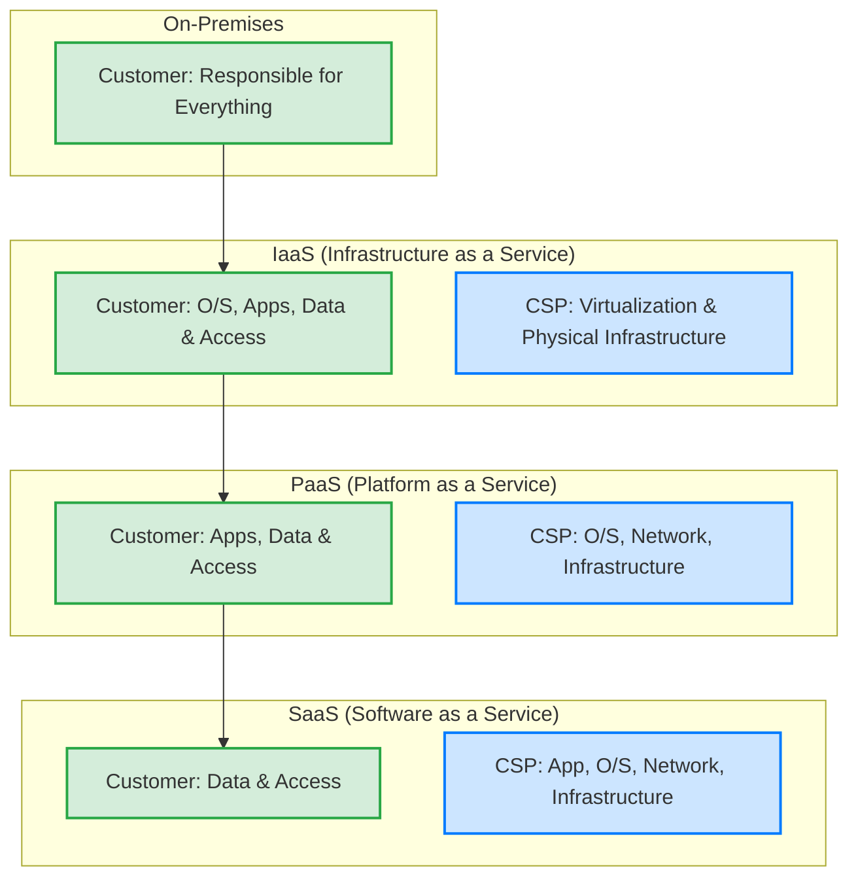
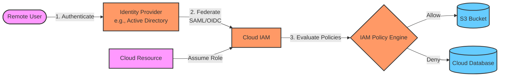
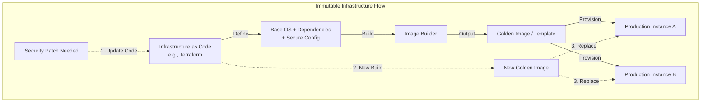
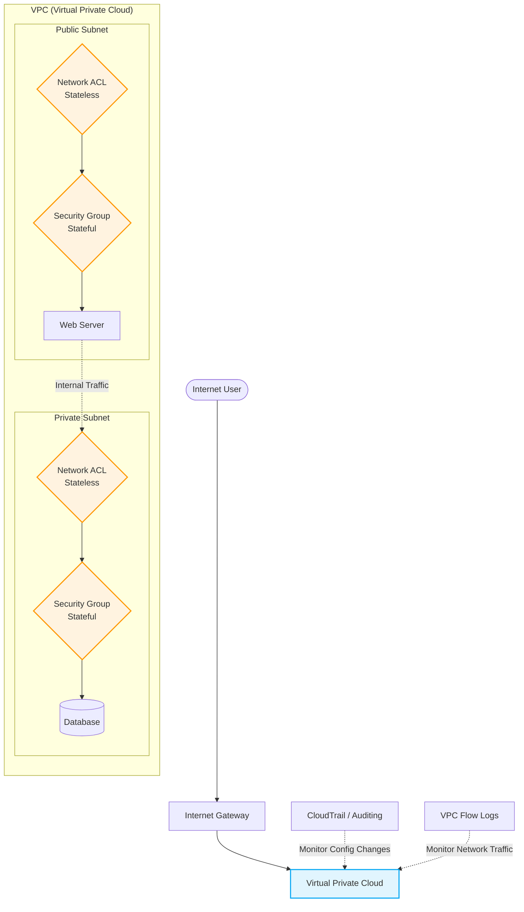

# Introduction to Cloud Security

Cloud computing has revolutionized how organizations deploy applications and store data, offering unprecedented scalability and agility. However, it also introduces a paradigm shift in security. In traditional on-premises environments, security focused heavily on the physical perimeter. In the cloud, the perimeter is dissolved, and identity becomes the new boundary.

This section explores the shared responsibility model and the unique security mechanisms necessary to protect cloud environments (Infrastructure as a Service - IaaS, Platform as a Service - PaaS, and Software as a Service - SaaS).

## The Shared Responsibility Model

Before securing anything in the cloud, you must understand who is responsible for what.

*   **Cloud Service Provider (CSP) Responsibility:** "Security *of* the Cloud." The CSP (AWS, Azure, GCP) is responsible for protecting the infrastructure that runs all of the services offered in the cloud (hardware, software, networking, and facilities).
*   **Customer Responsibility:** "Security *in* the Cloud." The customer is responsible for the secure configuration of the resources they deploy (guest OS patching, data encryption, IAM policies, network firewall rules).

*Note: The customer's responsibility decreases as they move from IaaS to PaaS to SaaS, but they are **always** responsible for their data and who has access to it.*

## 1. Identity and Access Management (IAM) in the Cloud

IAM is the most critical security control in the cloud. A misconfigured firewall might expose a server, but a misconfigured IAM policy can expose an entire organization.

*   **The New Perimeter:** Since cloud resources can be accessed from anywhere over the internet, identity verification replaces the traditional network firewall as the primary defense mechanism.
*   **Least Privilege:** Granting users and services only the minimum permissions necessary to perform their tasks. In the cloud, this applies not just to humans, but to services (e.g., an EC2 instance needing permission to write to an S3 bucket).
*   **Multi-Factor Authentication (MFA):** Essential for all human accounts, especially root or administrative users.
*   **Federated Identity:** Integrating on-premises directories (like Active Directory) with cloud IAM via SAML or OIDC to allow single sign-on (SSO) and centralized credential management.

## 2. Cloud Compute and Configuration Management

When deploying virtual machines (VMs) or containers in IaaS/PaaS, the traditional security principles still apply, but at a massive, automated scale.

*   **Golden Images:** Instead of configuring VMs manually, organizations create hardened, pre-configured "golden images" (AMIs in AWS). When a new server is needed, it is spawned from this secure template.
*   **Immutable Infrastructure:** Instead of patching or updating a running server, you replace it entirely with a newer, patched golden image. This prevents configuration drift and removes the ability for an attacker to maintain persistence on a machine.
*   **Cloud Security Posture Management (CSPM):** Tools that continuously monitor cloud environments against compliance frameworks and best practices, automatically alerting or remediating misconfigurations (e.g., an S3 bucket accidentally made public).

## 3. Cloud Data Protection and Automation

Protecting data in the cloud requires a combination of encryption, classification, and automated enforcement.

*   **Encryption at Rest:** Ensuring data stored on block storage (e.g., EBS), object storage (e.g., S3), and databases is encrypted using provider-managed keys (SSE) or customer-managed keys (CMK) via Key Management Services (KMS).
*   **Encryption in Transit:** Enforcing TLS 1.2+ for all data moving into, out of, and laterally within the cloud.
*   **Automation:** Using Infrastructure as Code (IaC) tools like Terraform, AWS CloudFormation, or Azure Resource Manager (ARM). Security can be embedded into the code, ensuring every deployment is secure by default (DevSecOps).

## 4. Cloud Networking and Logging

Network segmentation in the cloud is defined by software, not physical switches.

*   **Virtual Private Clouds (VPCs):** Logically isolated sections of the cloud where you can launch resources in a virtual network that you define.
*   **Security Groups and Network ACLs:** Stateful (Security Groups applied to the VM interface) and stateless (NACLs applied to the subnet) firewalls that control inbound and outbound traffic.
*   **Cloud Flow Logs:** Capturing IP traffic going to and from network interfaces in your VPC for intrusion detection and troubleshooting.
*   **Control Plane Telemetry:** Auditing all API calls made within the cloud account (e.g., AWS CloudTrail). This is vital for determining who changed a configuration and when.

## 5. Compliance, Incident Response, and Penetration Testing in the Cloud

Security operations adapt to the cloud environment.

*   **Compliance:** CSPs provide compliance reports (SOC 2, ISO 27001, FedRAMP) for their infrastructure (Security *of* the Cloud). Customers inherit this compliance but must still prove they have secured their own workloads (Security *in* the Cloud).
*   **Incident Response:** IR in the cloud relies heavily on automation and APIs. Instead of physically isolating a server, an automated script might alter a Security Group to quarantine the instance, take a forensic snapshot of the disk, and alert the SOC team.
*   **Penetration Testing:** You cannot perform denial-of-service (DoS) attacks or test the underlying hypervisor without express permission from the CSP. Pen tests in the cloud focus heavily on testing authorized configurations, exploiting poor IAM policies, and discovering exposed storage buckets or APIs.

## References & Further Learning

**HackerRepo (GitHub)**
*   [Cloud Security Resources](https://github.com/The-Art-of-Hacking/h4cker/tree/master/cloud-resources)
*   [Docker and Kubernetes Security](https://github.com/The-Art-of-Hacking/h4cker/tree/master/docker-and-k8s-security)

**Hacker Training**
*   [Practical Cybersecurity Fundamentals (Video Course)](https://learning.oreilly.com/course/practical-cybersecurity-fundamentals/9780138037550/)
*   [Hacking Scenarios (Cloud-based Labs)](https://hackingscenarios.com/)
