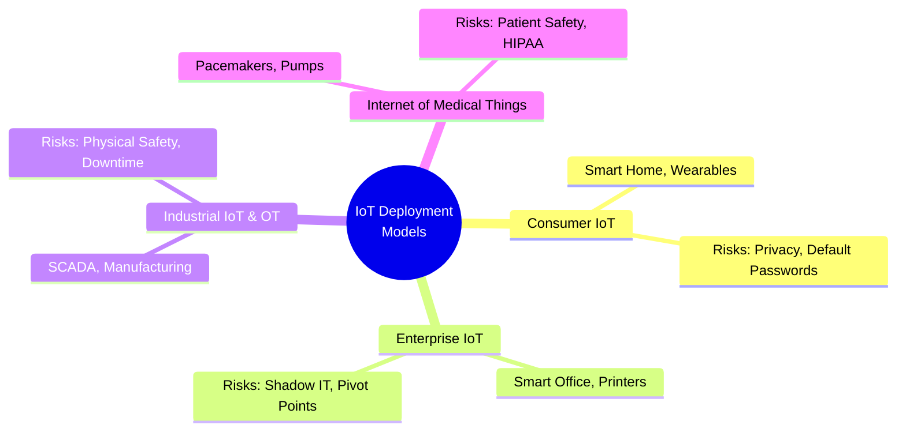
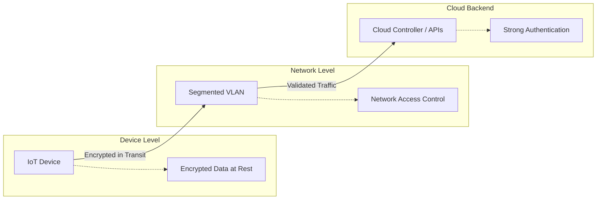
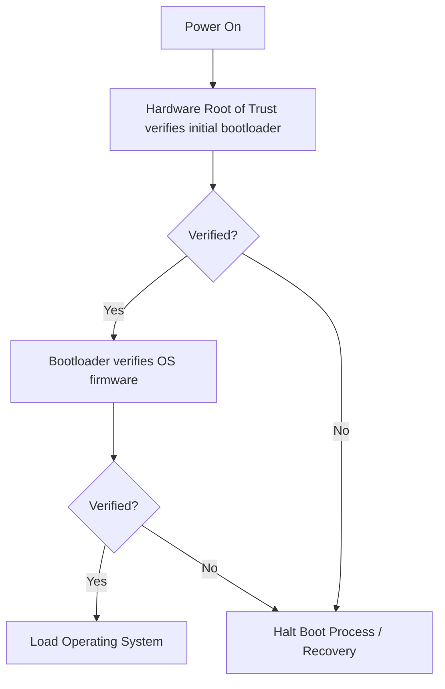

# Introduction to IoT Security

The Internet of Things (IoT) extends internet connectivity beyond traditional devices like desktop and laptop computers, smartphones, and tablets to a diverse range of devices and everyday things that utilize embedded technology to communicate and interact with the external environment. 

While IoT drives massive innovation across industries (manufacturing, healthcare, smart homes), it introduces unique and often severe cybersecurity challenges.

## 1. IoT Fundamentals and the Threat Landscape

IoT devices differ fundamentally from traditional IT endpoints:
*   **Resource Constraints:** Many IoT devices have limited CPU, memory, and battery life, making it impossible to run traditional antivirus agents or use heavy cryptographic algorithms.
*   **Physical Exposure:** Devices (like smart cameras, environmental sensors, or medical equipment) are often deployed in unsecure, publicly accessible areas where they can be physically tampered with.
*   **Longevity and Patching:** IoT devices are often expected to run for a decade or more, long after the manufacturer has stopped providing security patches. Furthermore, the patching mechanism is frequently nonexistent or requires manual intervention.

### The Threat Landscape
The Mirai botnet (which brought down major portions of the internet in 2016 by compromising hundreds of thousands of weak-password IP cameras and routers) proved that unsecured IoT at scale is a global threat. Attackers target IoT for:
*   **Botnets (DDoS):** Enslaving devices to launch massive attacks.
*   **Pivot Points:** Using an insecure IoT device (like a smart thermostat) to gain a foothold on the internal corporate network and move laterally to value-rich targets.
*   **Data Theft/Privacy Breaches:** Eavesdropping on audio/video streams or intercepting sensitive data transmitted by the device.
*   **Ransomware/Sabotage:** Disabling critical industrial IoT (IIoT) devices (e.g., in a manufacturing plant or hospital) until a ransom is paid.

## 2. IoT Deployment Models and Cybersecurity Risks

IoT is not a monolith; the risks vary depending on how and where the devices are used.

*   **Consumer IoT (CIoT):** Smart home devices, wearables. *Primary Risks:* Privacy invasion, poor default passwords, lack of software updates, and impact on the user's home network.
*   **Enterprise IoT (EIoT):** Smart office HVAC, connected printers, smart lighting. *Primary Risks:* Shadow IT (devices installed by facilities without IT knowledge), serving as pivot points into the corporate network.
*   **Industrial IoT (IIoT) & OT (Operational Technology):** SCADA systems, manufacturing robots, energy grids. *Primary Risks:* Physical safety (if a robot goes rogue, people can get hurt), massive financial downtime. In IIoT, Availability and Integrity often trump Confidentiality (the CIA triad is flipped).
*   **Internet of Medical Things (IoMT):** Connected pacemakers, infusion pumps. *Primary Risks:* Patient safety and HIPAA violations.

## 3. Data Protection, Privacy, Web/Cloud, and Network Security

Securing IoT requires a defense-in-depth approach spanning the device, the network, and the cloud backend.

*   **Data Protection & Privacy:** Data must be encrypted both at rest (on the device storage) and in transit. Devices should practice data minimization (only collecting what is necessary).
*   **Network Security:** 
    *   **Segmentation is vital.** IoT devices should *never* be placed on the same network segment as corporate workstations or servers. They should be isolated in their own VLANs with strict firewalls controlling what they can talk to (usually only their specific cloud controller).
    *   **NAC (Network Access Control):** Using protocols like 802.1x or MAC authentication bypass to profile and authenticate headless devices when they connect to the network.
*   **Web/Cloud Security:** Most IoT devices connect to a cloud backend via APIs. These APIs are a major attack vector and must be secured against traditional web vulnerabilities (OWASP API Top 10) and require strong authentication.

## 4. Securing Production and the Supply Chain

Security must begin during the manufacturing process, not as an afterthought.

*   **Secure Boot:** Cryptographically verifying that the firmware running on the device is authorized by the manufacturer before the operating system loads.
*   **Hardware Root of Trust:** Using a Secure Element (SE) or Trusted Platform Module (TPM) to securely store cryptographic keys in hardware, making them extremely difficult to extract.
*   **Supply Chain Risks:** Ensuring third-party components (like open-source software libraries or off-the-shelf system-on-chips) are free of vulnerabilities before integrating them into the final product.

## 5. IoT Vulnerability Disclosure and Management

Because IoT involves hardware, the vulnerability lifecycle is complex.

*   **CVD (Coordinated Vulnerability Disclosure):** Organizations must establish clear, public channels for security researchers to report vulnerabilities found in their IoT products safely.
*   **Over-The-Air (OTA) Updates:** Devices must have a secure, authenticated mechanism to receive firmware updates remotely.

## 6. Legislation, Regulation, and the Future

Governments are stepping in because the market failed to secure consumer IoT devices voluntarily.

*   **Cyber Trust Marks:** Initiatives (like the FCC's proposed U.S. Cyber Trust Mark or the EU's CE marking requirements under the Cyber Resilience Act) to label devices that meet baseline security standards, helping consumers make informed choices.
*   **Legislation:** Laws like the California IoT Security Law (SB-327) mandate that connected devices must have "reasonable security features," effectively banning default hardcoded passwords like "admin/admin".
*   **Standards:** Growing reliance on standards like NIST IR 8259 (Foundational Cybersecurity Activities for IoT Device Manufacturers) and ETSI EN 303 645 (Cyber Security for Consumer Internet of Things).

## References & Further Learning

**HackerRepo (GitHub)**
*   [IoT Hacking Resources](https://github.com/The-Art-of-Hacking/h4cker/tree/master/iot-hacking)
*   [Car Hacking Resources](https://github.com/The-Art-of-Hacking/h4cker/tree/master/car-hacking)

**Hacker Training**
*   [Practical Cybersecurity Fundamentals (Video Course)](https://learning.oreilly.com/course/practical-cybersecurity-fundamentals/9780138037550/)
