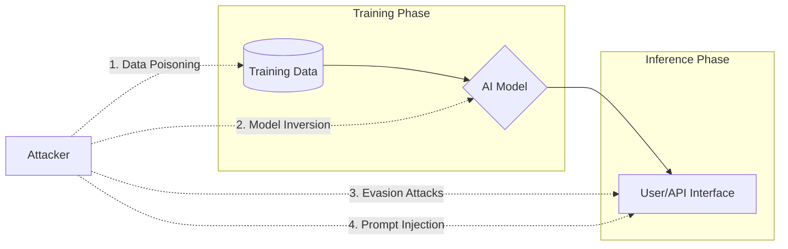
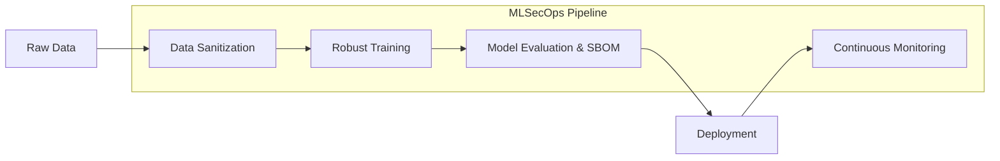
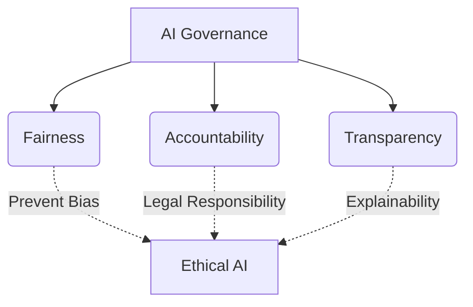

# Introduction to AI Security

Artificial Intelligence (AI) and Machine Learning (ML) are transforming every industry. However, just as we revolutionized networking and applications only to discover massive security flaws later, we are currently experiencing the same paradigm shift with AI. 

Securing AI is a dual-edged sword: we must secure the models themselves from attacks, and we must also prepare to defend against attackers who are using AI to augment their own capabilities.

## 1. Understanding AI Threats and Vulnerabilities



AI systems introduce entirely new classes of vulnerabilities that traditional security tools (like firewalls or antivirus) cannot detect.

*   **Prompt Injection:** (Specific to Large Language Models - LLMs) An attacker crafts a malicious input that bypasses the model's safety filters or instructions, causing it to perform unintended actions (e.g., revealing sensitive data, generating toxic content, or executing malicious code if the LLM is connected to an API).
*   **Data Poisoning:** An attacker intentionally compromises the training data used to build the model. If an AI learns from malicious data, its future predictions or classifications will be fundamentally flawed. (e.g., poisoning a spam filter to always allow emails from a specific malicious domain).
*   **Model Inversion / Data Extraction:** Attackers query a model repeatedly to reverse-engineer it or extract the sensitive, proprietary data it was trained on (e.g., extracting PII from a healthcare AI).
*   **Evasion Attacks (Adversarial Examples):** Modifying the input data at inferencing time in a way that is imperceptible to humans but causes the AI to make a gross misclassification. (e.g., adding imperceptible stickers to a stop sign so an autonomous vehicle classifies it as a speed limit sign).

## 2. Securing Machine Learning Models



Securing an ML pipeline requires moving security "left," integrating it into the data science workflow (MLSecOps).

*   **Robust Training:** Training models using adversarial examples so they learn to ignore small perturbations in input data.
*   **Input Validation & Sanitization:** Treating LLM prompts like any other untrusted user input. Using secondary "guardrail" models to scan inputs for malicious intent before passing them to the primary LLM.
*   **Model Provenance and SBOMs:** Tracking exactly what data was used to train a model, what algorithms were used, and generating an AI Bill of Materials (AI-BOM) to track components for known vulnerabilities.
*   **Rate Limiting and Monitoring:** Limiting the number of queries a single user can make to mitigate Model Inversion attacks and continuously monitoring model outputs for sudden shifts in accuracy (model drift).

## 3. Governance and Compliance in AI



Deploying AI without governance creates massive legal and reputational risks.

*   **The AI Triad (Fairness, Accountability, Transparency):**
    *   *Fairness:* Ensuring the model does not exhibit bias against protected classes (e.g., race, gender) in decisions like hiring or loan approvals.
    *   *Accountability:* Determining who is legally and ethically responsible when an AI makes a harmful decision.
    *   *Transparency (Explainability):* The ability to understand *why* the AI made a specific decision. Black-box models are increasingly unacceptable in regulated industries.
*   **Regulatory Frameworks:** Global regulations are emerging rapidly.
    *   *EU AI Act:* A risk-based legal framework classifying AI systems by risk level, with strict requirements for "High-Risk" AI (e.g., biometric identification, critical infrastructure).
    *   *NIST AI RMF (Risk Management Framework):* A voluntary framework to help organizations incorporate trustworthiness considerations into the design, development, use, and evaluation of AI products.

## 4. AI in Adversarial Tactics and Defense

```mermaid
graph TD
    subgraph Offensive AI
        A1[Hyper-Personalized Phishing]
        A2[Automated Vulnerability Discovery]
        A3[Polymorphic Malware]
        A4[Deepfakes]
    end

    subgraph Defensive AI
        D1[Behavioral Analytics / UEBA]
        D2[Automated Triage and Response]
        D3[Threat Hunting via NLP]
    end

    Offensive AI <-->|Continuous Arms Race| Defensive AI
```

AI changes the economics of cyber warfare for both the attacker and the defender.

### The Attacker's Use of AI (Offensive AI)
*   **Hyper-Personalized Phishing:** Using LLMs to scrape social media and generate flawless, highly targeted spear-phishing emails at scale, eliminating the traditional "bad grammar" red flags.
*   **Automated Vulnerability Discovery:** Using AI to analyze software code and rapidly identify zero-day vulnerabilities faster than human researchers.
*   **Polymorphic Malware:** Malware that uses AI to dynamically rewrite its own code to evade signature-based detection while maintaining its malicious functionality.
*   **Deepfakes:** AI-generated audio and video used for social engineering (e.g., a vishing call that perfectly mimics a CEO's voice ordering a fraudulent wire transfer).

### The Defender's Use of AI (Defensive AI)
*   **Behavioral Analytics (UEBA):** AI is excellent at establishing baselines of "normal" behavior for users and entities on a network, making it highly effective at spotting anomalies (like a compromised account suddenly downloading gigabytes of data).
*   **Automated Triage and Response:** Using AI to pre-analyze the thousands of alerts a SOC receives daily, dismissing false positives, and automatically grouping related alerts into a single actionable incident.
*   **Threat Hunting:** Empowering analysts to use natural language queries (e.g., "Show me all hosts that connected to Russia today") instead of writing complex SQL or SIEM queries, drastically accelerating investigation times.


## References & Further Learning

**HackerRepo (GitHub)**
*   [General Threat Hunting / AI Repos](https://github.com/The-Art-of-Hacking/h4cker/) *(check main repo for emerging AI security content)*

**Hacker Training**
*   [AI-Powered Digital Cyber Resilience (Book)](https://www.oreilly.com/library/view/ai-powered-digital-cyber/9780135408599/)
*   [Beyond the Algorithm: AI, Security, Privacy, and Ethics (Book)](https://learning.oreilly.com/library/view/beyond-the-algorithm/9780138268442)
*   [The AI Revolution in Networking, Cybersecurity, and Emerging Technologies (Book)](https://learning.oreilly.com/library/view/the-ai-revolution/9780138293703)
*   [Build Your Own AI Lab (Video Course)](https://learning.oreilly.com/course/build-your-own/9780135439616)
*   [Defending and Deploying AI (Video Course)](https://www.oreilly.com/videos/defending-and-deploying/9780135463727/)
*   [Securing Generative AI (Video Course)](https://learning.oreilly.com/course/securing-generative-ai/9780135401804/)
