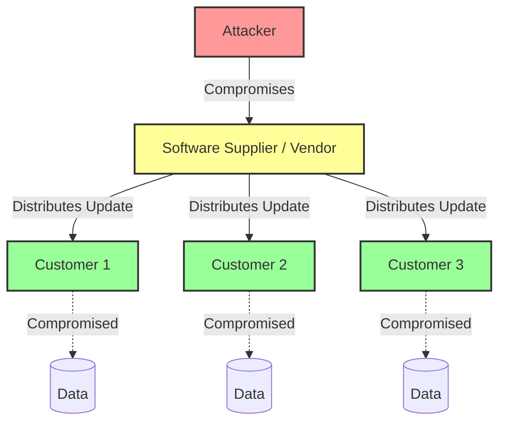
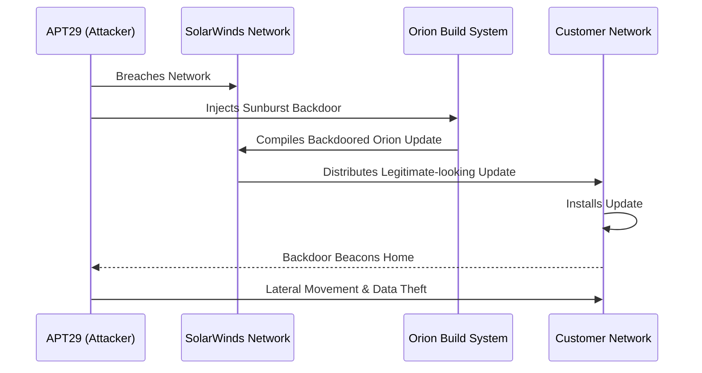
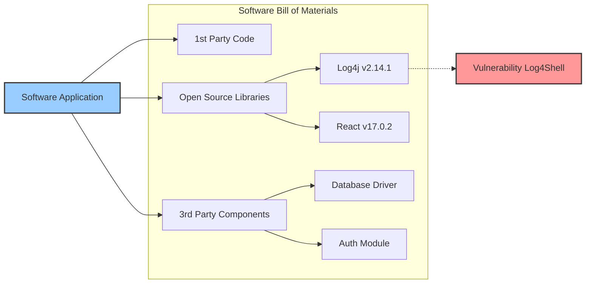

# Supply Chain Security

The modern enterprise does not write all of its own software or build all of its own hardware. We rely on a massive, complex web of third-party vendors, open-source libraries, managed service providers, and cloud platforms. This interconnectedness is the supply chain.

Supply Chain Security is the practice of managing the risks associated with outside parties that provision products or services to your organization. If a highly secure intelligence agency uses a vulnerable IT management tool (like what happened with SolarWinds), the agency's internal security controls are bypassed entirely.

## 1. Understanding Software Supply Chain Risks

Attackers have realized it is often easier to compromise a single supplier who services many targets rather than attacking each target individually.

### Types of Supply Chain Attacks
*   **Upstream Open Source Attacks:** Injecting malicious code into popular open-source repositories (like npm, PyPI, or RubyGems). When developers globally pull the updated (but malicious) package into their applications, their applications become compromised. *Example: Typosquatting (naming a malicious package a similar name to a real one) or compromising a maintainer's account.*
*   **Compromised Build Pipelines (CI/CD):** Attackers breach a software company's build environment and inject a backdoor into the compiled software right before it is digitally signed. The customer downloads a legitimate, signed update from the official vendor that contains malware.
*   **Hardware Interdiction:** Tampering with hardware (routers, servers) in transit from the manufacturer to the customer, installing physical backdoors.
*   **Managed Service Provider (MSP) Compromise:** Attackers breach an IT provider to gain access to all of the provider's downstream clients via their remote management tools (RMM). *Example: The Kaseya VSA ransomware attack.*

## 2. Case Studies: SolarWinds and Similar Attacks

Understanding past attacks is crucial to defending against future ones.

### The SolarWinds Sunburst Attack (2020)
This represents one of the most sophisticated supply chain attacks in history.

*   **How it happened:** A nation-state actor (attributed to Russia's APT29) breached SolarWinds, a company that makes IT monitoring software (Orion) used by Fortuno 500 companies and US government agencies.
*   **The Infiltration:** The attackers remained undetected in SolarWinds' network for months. They subtly injected malicious code (the Sunburst backdoor) into the Orion build process. 
*   **The Deployment:** SolarWinds unwittingly distributed this backdoored software as a legitimate update to approximately 18,000 customers.
*   **The Impact:** The backdoor allowed attackers to move laterally into the customer networks, steal data, and compromise Microsoft 365 environments. Because the software was a trusted network monitoring tool, its malicious beaconing was often ignored by security teams.

### Log4j / Log4Shell (2021)
While not a targeted attack, it highlights open-source risk. Log4j is a ubiquitous Java logging library. A critical zero-day vulnerability (Log4Shell) was discovered that allowed unauthenticated Remote Code Execution (RCE). The challenge was that many companies didn't even know they were using it because it was buried deep within the dependencies of other third-party software they bought.

## 3. Software Bill of Materials (SBOMs)

You cannot protect what you cannot see. Just as a food label lists ingredients so people with allergies know what to avoid, an SBOM lists the "ingredients" of software so security teams know what they are running.

*   **What is it?** A formal, machine-readable inventory (formats include SPDX and CycloneDX) detailing all the components, libraries, and dependencies that make up a software application.
*   **Why is it critical?** When the next Log4Shell happens, organizations with SBOMs can immediately query their inventory and say, "We have 15 applications using that specific vulnerable version of Log4j," rather than spending weeks manually searching systems.
*   **Government Mandates:** Executive Order 14028 in the United States places significant emphasis on software supply chain security, mandating that vendors selling software to the federal government must provide an SBOM.

## 4. Third-Party Vendor Risk Management (TPRM)

Organizations must assess and monitor the security posture of the companies they do business with.

*   **Due Diligence:** Conducting security assessments (questionnaires like SIG or CAIQ) before signing a contract with a vendor.
*   **Contractual Requirements:** Enforcing security standards (e.g., "The vendor must maintain SOC 2 Type II compliance," or "The vendor must notify us of a breach within 24 hours") in the Master Services Agreement (MSA).
*   **Continuous Monitoring:** Point-in-time assessments are insufficient. Organizations use external risk rating platforms (like SecurityScorecard or BitSight) to continuously monitor the public-facing security posture of their vendors.
*   **Zero Trust Architecture:** Even if a trusted vendor's software is running in your environment, adopting a Zero Trust mindset means continuously verifying its behavior and restricting its access via micro-segmentation to limit the blast radius if the vendor is compromised.

## References & Further Learning

**HackerRepo (GitHub)**
*   [Software Bill of Materials (SBOM) Resources](https://github.com/The-Art-of-Hacking/h4cker/tree/master/sbom)

**Hacker Training**
*   [Developing Cybersecurity Programs and Policies in an AI-Driven World (Book)](https://learning.oreilly.com/library/view/developing-cybersecurity-programs/9780138073992)
